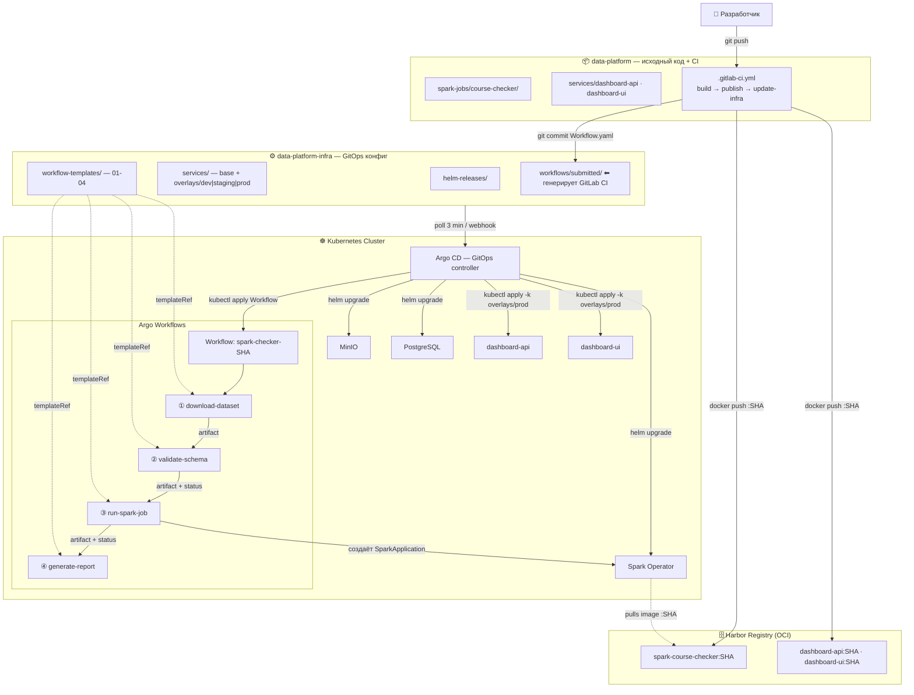

# Отчёт: Архитектура CI/CD пайплайна для развёртывания разнородных приложений в Kubernetes

**ФИО:** Фарахов Руслан Ильнурович  
**Курс:** Построение пайплайнов данных

## Введение

Задание требует спроектировать репозиторную структуру и описать полный CI/CD пайплайн для развёртывания в Kubernetes трёх классов приложений:

- **Spark-приложения** — пакетная обработка данных, запуск через Argo Workflows и Spark Operator;
- **Стороннее ПО через Helm** — Argo Workflows, Spark Operator, MinIO, PostgreSQL;
- **Внутренние витрины данных** — React/Node.js-сервисы со своими Dockerfile.

Решение строится на принципе GitOps из лекции: «CI собирает артефакт, GitOps следит, чтобы кластер пришёл к состоянию из репозитория». Связь с предыдущим Д3: переиспользуемые `WorkflowTemplate` из `hw11_example/templates/` становятся основой для CI/CD Spark-джобов — на их идее построены новые шаблоны в [`data-platform-infra/workflow-templates/`](data-platform-infra/workflow-templates/).

Архитектурная диаграмма (`diagram.puml`) ниже — в формате Mermaid, чтобы GitHub отрендерил её автоматически:



---

## Часть 1. Технологический стек

### 1.1 Выбор инструментов сборки и хранения артефактов

**CI-система: GitLab CI.** Pipeline-конфиг лежит рядом с кодом, поддерживает динамические переменные (`$CI_COMMIT_SHORT_SHA`), `rules.changes` запускает только нужные джобы. Меньше накладного расхода, чем у Jenkins; в отличие от Argo Workflows, нативно завязан на git-события.

**Реестр артефактов: Harbor.**

| Критерий | Harbor | Nexus | jFrog |
|---|---|---|---|
| Лицензия | Apache 2.0 | Core OSS, Pro платный | Платный |
| Docker (OCI) | да | да | да |
| Helm charts (OCI) | нативно | через plugin | да |
| Vulnerability scan | Trivy встроен | только в Pro | нет в OSS |
| RBAC | проектная модель | базовый | расширенный |

Harbor хранит в одном реестре и Docker-образы, и Helm-чарты в OCI-формате.

### 1.2 Сводная таблица стека

| Задача | Инструмент | Альтернативы | Обоснование |
|---|---|---|---|
| Сборка Docker-образов | GitLab CI | Jenkins, Argo WF | pipeline рядом с кодом |
| Хранение образов/чартов | Harbor | Nexus, jFrog | OCI, Trivy, всё в одном |
| GitOps CD-контроллер | Argo CD | Flux CD | UI, ApplicationSet, со слайда лекции |
| Оркестрация data-джобов | Argo Workflows + Spark Operator | Airflow | паттерн `templateRef` из Д3 |
| Деплой стороннего ПО | Helm | kubectl, Kustomize | rollback, versioning |
| Деплой внутренних сервисов | Kustomize | Helm | GitOps-основа, патчи без Go-шаблонов |

Разделение Helm/Kustomize взято со слайдов «Выбирайте Helm когда…» и «Выбирайте Kustomize когда…».

---

## Часть 2. Структура репозиториев

Проект использует **два репозитория** (GitOps-split). `data-platform` меняется на каждый коммит кода — если бы конфиг лежал в том же репо, Argo CD синхронизировал бы кластер на каждый пуш React-компонента. Infra-репо — единственный источник истины о желаемом состоянии кластера.

### 2.1 Репозиторий [`data-platform/`](data-platform/) — исходный код + CI

```
data-platform/
├── .gitlab-ci.yml
├── spark-jobs/
│   └── course-checker/
├── services/
│   ├── dashboard-api/
│   └── dashboard-ui/
└── ci/
    └── scripts/
```

| Путь | Назначение |
|---|---|
| [`.gitlab-ci.yml`](data-platform/.gitlab-ci.yml) | Главный CI-пайплайн: стадии `build → publish → update-infra` |
| [`spark-jobs/course-checker/`](data-platform/spark-jobs/course-checker/) | PySpark-приложение, Dockerfile, точка входа `main.py` |
| [`services/dashboard-api/`](data-platform/services/dashboard-api/) | Node.js backend, только Dockerfile (исходники приложения здесь не приводятся) |
| [`services/dashboard-ui/`](data-platform/services/dashboard-ui/) | React frontend, только Dockerfile |
| [`ci/scripts/`](data-platform/ci/scripts/) | Bash-скрипты для CI (генерация Workflow YAML, обновление newTag в Kustomize) |

Никаких K8s-манифестов в этом репо нет — только исходники и Dockerfile-ы.

### 2.2 Репозиторий [`data-platform-infra/`](data-platform-infra/) — GitOps-конфиг

```
data-platform-infra/
├── argocd/
│   └── applications/
├── helm-releases/
│   ├── argo-workflows/
│   ├── spark-operator/
│   ├── minio/
│   └── postgresql/
├── services/
│   ├── dashboard-api/
│   └── dashboard-ui/
├── workflow-templates/
└── workflows/
    └── submitted/
```

| Путь | Назначение |
|---|---|
| [`argocd/applications/`](data-platform-infra/argocd/applications/) | Argo CD `Application` для каждого компонента (Helm-релизы, Kustomize-сервисы, WorkflowTemplate-ы, поток сгенерированных Workflow) |
| [`helm-releases/`](data-platform-infra/helm-releases/) | Чарт-обёртки + `values.yaml` для стороннего ПО (Argo WF, Spark Operator, MinIO, PostgreSQL) |
| [`services/*/base/`](data-platform-infra/services/) | Базовые манифесты Deployment/Service для внутренних сервисов |
| [`services/*/overlays/dev\|staging\|prod/`](data-platform-infra/services/) | Kustomize-оверлеи: `replicas`, ресурсы, теги образов под среду |
| [`workflow-templates/`](data-platform-infra/workflow-templates/) | Переиспользуемые `WorkflowTemplate` (идея из Д3): `01-download`, `02-validate`, `03-spark-job`, `04-quality-report` |
| [`workflows/`](data-platform-infra/workflows/) | `spark-job-workflow-template.yaml` — заготовка для генерации; `submitted/` — конкретные Workflow CRD, которые коммитит GitLab CI |

### 2.3 Расположение ключевых артефактов задания

| Артефакт | Расположение |
|---|---|
| Helm charts для стороннего ПО | [`data-platform-infra/helm-releases/`](data-platform-infra/helm-releases/) |
| YAML внутренних сервисов | [`data-platform-infra/services/*/base/`](data-platform-infra/services/) |
| Kustomize overlays для сред | [`data-platform-infra/services/*/overlays/`](data-platform-infra/services/) |
| Переиспользуемые Argo WF шаблоны | [`data-platform-infra/workflow-templates/`](data-platform-infra/workflow-templates/) |
| Исходный код Spark-приложений | [`data-platform/spark-jobs/`](data-platform/spark-jobs/) |
| Исходный код React/Node.js сервисов | [`data-platform/services/`](data-platform/services/) |
| Argo Workflow CRD для запусков | [`data-platform-infra/workflows/submitted/`](data-platform-infra/workflows/submitted/) |

---

## Часть 3. Пайплайн от git push до запуска в кластере

### 3.1 GitLab CI: стадии и джобы

[`data-platform/.gitlab-ci.yml`](data-platform/.gitlab-ci.yml) определяет четыре стадии (`lint`, `build`, `publish`, `update-infra`) и три набора джобов: для Spark-приложения, для `dashboard-api`, для `dashboard-ui`. Все джобы используют `rules.changes`, чтобы не пересобирать всё при правке одного сервиса.

Логика для Spark-приложения:

1. `build-spark-course-checker` — `docker build` с тегом `$CI_COMMIT_SHORT_SHA`.
2. `publish-spark-course-checker` — `docker push` в Harbor + дополнительный тег `latest`.
3. `generate-and-commit-spark-workflow` — клонирует infra-репо, запускает [`ci/scripts/generate-spark-workflow.sh`](data-platform/ci/scripts/generate-spark-workflow.sh), коммитит сгенерированный Workflow с пометкой `[skip ci]` (защита от рекурсивных триггеров).

Для внутренних сервисов аналогично: `build-publish-dashboard-*` собирает и пушит образ, `update-dashboard-*-image-tag` обновляет `newTag` в `services/<svc>/overlays/prod/kustomization.yaml` через `yq`.

### 3.2 Генерация Workflow CRD

[`ci/scripts/generate-spark-workflow.sh`](data-platform/ci/scripts/generate-spark-workflow.sh) берёт заготовку [`workflows/spark-job-workflow-template.yaml`](data-platform-infra/workflows/spark-job-workflow-template.yaml) и подставляет через `yq` три значения:

- `metadata.name` → `spark-course-checker-<SHA>`;
- параметр `image-tag` → `<SHA>`;
- параметр `spark-image` → `harbor.../spark-course-checker:<SHA>`.

Результат коммитится в [`data-platform-infra/workflows/submitted/`](data-platform-infra/workflows/submitted/). Пример готового файла — [`spark-course-checker-abc1234.yaml`](data-platform-infra/workflows/submitted/spark-course-checker-abc1234.yaml). Он содержит DAG из 4 шагов, каждый — `templateRef` на соответствующий шаблон в [`workflow-templates/`](data-platform-infra/workflow-templates/):

| Шаг | templateRef | Шаблон |
|---|---|---|
| `download-dataset` | `download-dataset-template` | [`01-download-dataset-template.yaml`](data-platform-infra/workflow-templates/01-download-dataset-template.yaml) |
| `validate-schema` | `validate-schema-template` | [`02-validate-schema-template.yaml`](data-platform-infra/workflow-templates/02-validate-schema-template.yaml) |
| `run-spark-job` | `spark-job-template` | [`03-spark-job-template.yaml`](data-platform-infra/workflow-templates/03-spark-job-template.yaml) |
| `generate-report` | `quality-report-template` | [`04-quality-report-template.yaml`](data-platform-infra/workflow-templates/04-quality-report-template.yaml) |

Этот паттерн воспроизводит подход из `hw11_example/workflows/coursework-check-workflow.yaml` — один Workflow связывает несколько шаблонов через `templateRef`, шаблоны переиспользуются в разных пайплайнах без копирования логики.

### 3.3 Как Argo CD подхватывает Workflow

[`argocd/applications/submitted-workflows-app.yaml`](data-platform-infra/argocd/applications/submitted-workflows-app.yaml) следит за директорией `workflows/submitted/` с `prune: true` и `selfHeal: false` (`selfHeal` отключён намеренно — Workflow одноразовый, его `.status` мутирует, иначе Argo CD считал бы это drift'ом). Опция `Replace=true` нужна для иммутабельных полей `Workflow` после старта.

GitOps-цикл из лекции замыкается так:

1. GitLab CI коммитит `spark-course-checker-<SHA>.yaml` в infra-репо.
2. Argo CD замечает новый файл (опрос каждые 3 минуты или webhook).
3. `kubectl apply -f spark-course-checker-<SHA>.yaml -n argo`.
4. Argo Workflows controller через informer-watch видит новый `kind: Workflow` и запускает DAG.
5. На каждом шаге DAG резолвится `templateRef` → выполняется код из заранее применённого `WorkflowTemplate`.

`ttlStrategy` в спецификации Workflow (`secondsAfterCompletion: 86400`, `secondsAfterFailure: 604800`) гарантирует, что завершённые объекты не копятся в кластере вечно.

### 3.4 Helm для стороннего ПО

Каждый сторонний продукт описан Argo CD `Application` с источником-Helm-чартом из публичного репозитория и values-файлом из infra-репо. Примеры:

- [`argo-workflows-app.yaml`](data-platform-infra/argocd/applications/argo-workflows-app.yaml) — chart `argo-workflows` из `argoproj.github.io/argo-helm`, версия зафиксирована (`targetRevision: "0.42.2"`).
- [`spark-operator-app.yaml`](data-platform-infra/argocd/applications/spark-operator-app.yaml), [`minio-app.yaml`](data-platform-infra/argocd/applications/minio-app.yaml), [`postgresql-app.yaml`](data-platform-infra/argocd/applications/postgresql-app.yaml).

values-файлы лежат рядом: [`helm-releases/argo-workflows/values.yaml`](data-platform-infra/helm-releases/argo-workflows/values.yaml), [`helm-releases/minio/values.yaml`](data-platform-infra/helm-releases/minio/values.yaml) и т.д.

Паттерн «dependency wrapper» со слайда лекции про `Chart.yaml.dependencies` показан в [`helm-releases/argo-workflows/Chart.yaml`](data-platform-infra/helm-releases/argo-workflows/Chart.yaml). Для стороннего ПО `prune: false` — защита от случайного удаления release при ошибочной правке.

Обновление: оператор меняет `targetRevision` в `*-app.yaml` → коммит → Argo CD вызывает `helm upgrade`. Откат: `helm rollback <release> <revision>` (для критичных случаев) или `git revert` в infra-репо.

### 3.5 Kustomize для внутренних сервисов

Структура из лекции: один `base/` + по оверлею на каждую среду. Базовые манифесты (`deployment.yaml`, `service.yaml`, `kustomization.yaml`) для `dashboard-api`: [`services/dashboard-api/base/`](data-platform-infra/services/dashboard-api/base/).

Оверлеи задают всё, что отличает среды:

- [`overlays/dev/kustomization.yaml`](data-platform-infra/services/dashboard-api/overlays/dev/kustomization.yaml) — `replicas: 1`, `newTag: latest`.
- [`overlays/staging/kustomization.yaml`](data-platform-infra/services/dashboard-api/overlays/staging/kustomization.yaml) — `replicas: 2`, тег по SHA.
- [`overlays/prod/kustomization.yaml`](data-platform-infra/services/dashboard-api/overlays/prod/kustomization.yaml) — `replicas: 3`, resource limits, тег по SHA. GitLab CI правит только этот файл.

Argo CD `Application` для prod-оверлея: [`dashboard-api-app.yaml`](data-platform-infra/argocd/applications/dashboard-api-app.yaml). Откат сервиса: `git revert` коммита, который обновил `newTag` → Argo CD sync → `kubectl apply -k` применяет предыдущий образ.

---

## Часть 4. Обоснование архитектуры

### 4.1 Helm vs Kustomize в этом проекте

| Критерий | Helm (стороннее ПО) | Kustomize (внутренние сервисы) |
|---|---|---|
| Источник манифестов | публичный chart | свой YAML в Git |
| Шаблонизация | Go-templates + `values.yaml` | JSON-патчи поверх base |
| Rollback | `helm rollback` | `git revert` + Argo CD sync |
| Версионирование | chart version | Git SHA коммита |
| Зависимости | `Chart.yaml.dependencies` | нет |
| Встроен в kubectl | нет | да (с 1.14) |
| Когда применять | стороннее ПО, сложная параметризация | свои сервисы, GitOps, патч чужого манифеста |

Гибридный подход (`helmCharts:` внутри `kustomization.yaml` или `helm install --post-renderer`) в проекте не нужен — чёткое разграничение справляется.

### 4.2 Четыре ключевых преимущества схемы

**1. Переиспользование WorkflowTemplates.** Все Spark-джобы ссылаются на 4 шаблона из `workflow-templates/` через `templateRef`, не дублируя логику. Добавление нового джоба — это новый файл в `workflows/submitted/` с другими параметрами, без правки шаблонов. Тот же приём показан в Д3.

**2. Версионирование артефактов.** Тег Docker-образа = `$CI_COMMIT_SHORT_SHA`. Имя сгенерированного Workflow содержит тот же SHA. По имени запуска в Argo Workflows находится точный коммит в `data-platform` → diff → MR → ревью. Harbor хранит все версии, можно перезапустить со старым SHA.

**3. Изоляция конфигурации сред.** Kustomize overlays — единственное место, где задаётся environment-специфичная конфигурация. Разработчик, правящий `base/deployment.yaml`, физически не может задеть prod-параметры.

**4. Упрощение отката.**

- Helm: `helm history <release>` → `helm rollback <release> <revision>`.
- Внутренние сервисы: `git revert <sha>` в infra-репо → Argo CD sync.
- Workflow: `git rm workflows/submitted/<file>.yaml` + push → Argo CD с `prune: true` удаляет объект; `ttlStrategy` дочищает старые автоматически.

Состояние кластера полностью описано в двух Git-репозиториях — новый инженер получает понимание развёртывания через `git clone`.

---

## Раздел 5. Верификация

```bash
# 1. WorkflowTemplates применены
kubectl get workflowtemplate -n argo
# Ожидание: download-dataset-template, validate-schema-template,
#           spark-job-template, quality-report-template

# 2. Все Argo CD Applications в Synced/Healthy
argocd app list

# 3. Submitted-workflows Application видит свежий Workflow
argocd app get submitted-workflows

# 4. Workflow исполняется
kubectl get workflow -n argo
argo logs -n argo spark-course-checker-abc1234

# 5. Helm-релизы и история
helm history argo-workflows -n argo
helm history minio -n minio

# 6. Spark Operator создал SparkApplication
kubectl get sparkapplication -n argo

# 7. Dry-run Kustomize prod-оверлея
kubectl kustomize data-platform-infra/services/dashboard-api/overlays/prod \
  | grep -E "replicas|image"

# 8. Тег в Harbor
curl -u ${HARBOR_USER}:${HARBOR_PASSWORD} \
  https://harbor.internal.example.com/v2/data-platform/spark-course-checker/tags/list
```

---

## Раздел 6. Проверка логики (что важно при практическом запуске)

В ходе подготовки решения учтены несколько неочевидных мест, без которых пайплайн ломается:

1. **Один executor на `WorkflowTemplate`.** В `03-spark-job-template.yaml` нельзя одновременно описать `resource:` и `script:` — Argo Workflows примет только один тип executor'а. Реализация использует `script:`, который и создаёт `SparkApplication` через `kubectl apply`, и опрашивает `.status.applicationState.state`.
2. **`selfHeal: false` для submitted-workflows.** `Workflow` — одноразовый объект с мутирующим `.status`. Если включить `selfHeal: true`, Argo CD будет постоянно видеть drift между Git и кластером.
3. **`ttlStrategy` обязательна.** Без `secondsAfterCompletion` объекты Workflow копятся в `argo` namespace бесконечно. Заданы 24 часа для успешных и 7 дней для упавших.
4. **`[skip ci]` в коммитах CI в infra-репо.** Без него каждый коммит CI триггерил бы CI infra-репо (если он там настроен) → бесконечный цикл.
5. **Версии чартов зафиксированы.** `targetRevision: "0.42.2"` (а не `HEAD` или `*`) — иначе обновление произойдёт неконтролируемо и Argo CD сделает `helm upgrade` без ревью.
6. **`prune: false` для стороннего ПО.** Случайное удаление файла в `helm-releases/` не должно сносить production-релиз. Для `workflow-templates/` тоже `prune: false` — удалить шаблон, на который опираются десятки Workflow, легко не глядя.
